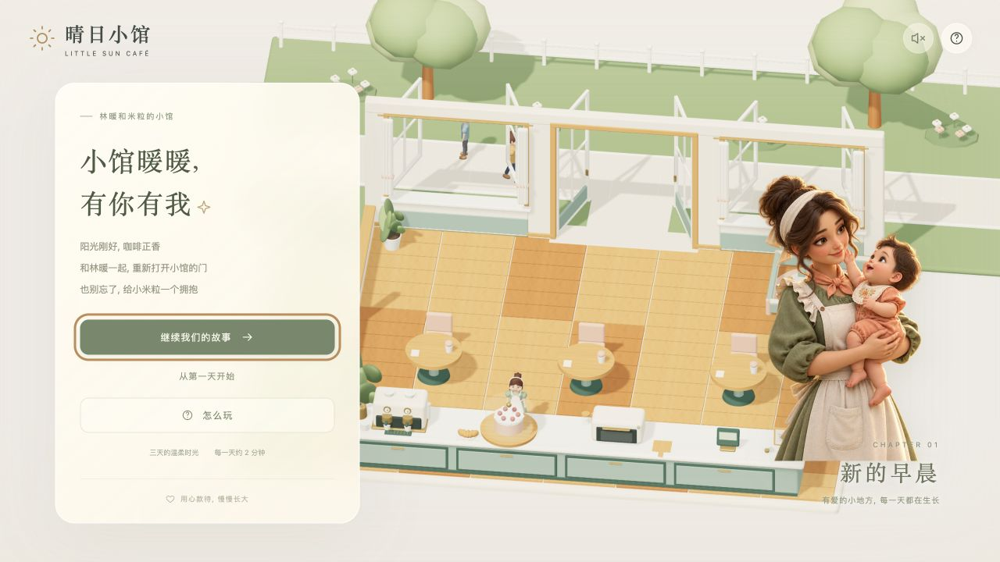
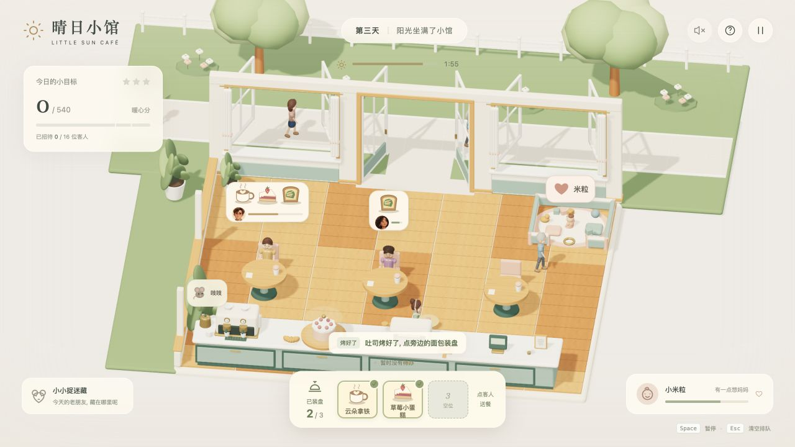
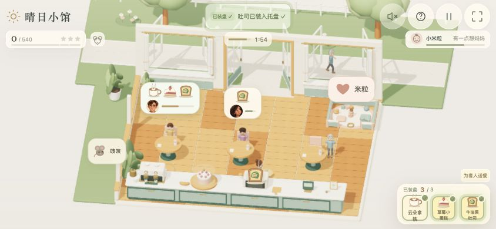

# 晴日小馆 | Little Sun Café

小馆暖暖, 有你有我
和林暖一起经营一家阳光下的小馆, 准备热咖啡和点心, 招呼客人, 也给宝宝米粒一个拥抱
这是一个原创实时 3D 网页游戏首章, 包含 3 天营业与中文剧情, 每天约 2 分钟, 无需注册游戏账号

## 开始游玩

[打开晴日小馆](https://wr-fenglei.github.io/little-sun-cafe/)

支持电脑浏览器和手机, 点开首页的打开小馆即可开始, 有进度时可继续我们的故事
电脑使用鼠标, 手机直接触碰机器, 客人订单和宝宝, 声音默认关闭, 可在右上角开启

## 游戏截图

首页, 1280 x 720

营业中的小馆, 顾客点单与餐点装盘

手机横屏预览, 844 x 390 浏览器视口

## 怎样经营

1. 点前台机器或食物安排取餐, 林暖会按顺序执行动作
2. 看到彩色食物图标, 勾号和已装盘数量后, 点客人订单送餐, 托盘最多放 3 份
3. 客人吃好后点收银台, 一次收下所有待结账客人的实际餐费
4. 点留下餐盘的桌子清理, 让下一位客人坐下

- 已安排和正在执行表示动作尚未完成, 轮廓文字不代表已经装盘
- 快速重复点击同一道食物会提示已收到, 托盘满了先送餐, 要移除食物时先选中它再点移除
- 第 2 天加入吐司, 点一次开始烤, 烤好后再点取走
- 可以先送已有餐点, 客人会先吃, 吃饭时仍可补餐, 吃完已有食物却还缺餐时会继续等待
- 首次上餐和续餐的等待会影响心情, 最后补齐不会立刻消除之前的不满
- 快速上齐全部餐点并及时结账可获 +10% 或 +20% 小费, 久等生气则只付 50% 餐费, 其余按原价
- 四种个性使用共 32 幅绘制头像, 随等待和用餐心情选择不同细节, 结账气泡提示当前价格
- 宝宝在后排右侧窗边的围栏游戏角内爬行, 想要拥抱时点她, 看见小老鼠就点它
- 电脑按空格暂停, 按 Esc 取消后续排队动作, 当前工作继续完成, 切到后台会自动暂停

## 手机与主屏幕

游戏会自动使用横向布局, iPhone 锁定竖屏时也能进入, 将手机横过来观看即可, 无需解除方向锁
咖啡机, 蛋糕, 面包机和收银台都在前景, 托盘在右下, 主要点击区域至少 44 px

想隐藏 Safari 工具栏, 可以从主屏幕网页 App 进入

1. 在 Safari 打开游戏, 点分享, 再点添加到主屏幕
2. 如果出现作为网页 App 打开选项, 保持开启, 再点添加
3. 回到主屏幕, 点击晴日小馆图标启动

分享入口因 Safari 布局而异, 可参考 [Apple 官方步骤](https://support.apple.com/zh-cn/guide/iphone/iphea86e5236/ios)
支持原生全屏的触控浏览器会在开始时尝试全屏, 不支持或失败仍可游玩, 电脑不会自动全屏

## 保存进度

解锁天数和最高分保存在当前浏览器, 刷新后从当天开场重新开始, 不保存营业中的实时状态
清除站点数据会删除记录, 更换浏览器, 设备或打开方式不会自动同步存档

## 关于此仓库

本仓库提供构建后的静态网页, 无需后台服务, 可以直接部署到静态托管平台
这里不包含开发源码或 npm 项目文件, 不适用 npm 安装与开发命令

当前为首章 3 天, 100 项自动测试通过, 整单上餐三天均可达三星, 后续关卡尚未加入
截图取自真实浏览器游玩, 手机图为横屏视口预览, 新功能尚未完成实际 iPhone 触控手感与主屏幕模式验收
首次打开请保持联网, 不保证所有浏览器都能离线游玩

第三方依赖声明见 [THIRD-PARTY-NOTICES.txt](THIRD-PARTY-NOTICES.txt)
